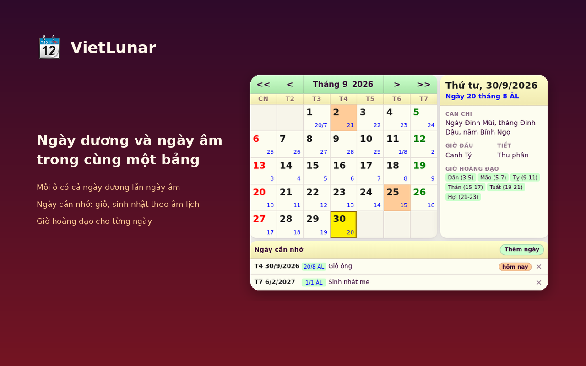

# VietLunar — Âm lịch Việt Nam

Hiện ngày âm trên thanh công cụ Chrome, bấm ra cả tháng dương + âm.

[Cài trên Chrome Web Store](https://chromewebstore.google.com/detail/vietlunar-lunar-calendar/blklnljefnfkonpnmknbbglbbhbhjieg).



## Tính năng

- Mỗi ô có cả ngày dương và ngày âm
- Chọn một ngày để xem Can Chi, tiết khí, giờ hoàng đạo
- Box «Ngày lễ âm lịch sắp tới» liệt kê lễ âm kèm đếm ngược — bấm để nhảy tới tháng đó
- Box «Ngày cần nhớ»: lưu giỗ, sinh nhật theo ngày âm — bấm để nhảy tới tháng đó
- Icon toolbar là số ngày âm hôm nay, tự làm mới sau nửa đêm
- Chạy offline hoàn toàn: không tài khoản, không theo dõi, không truy cập mạng
- Giao diện tiếng Việt và tiếng Anh

Thuật toán âm lịch của Hồ Ngọc Đức. Hỗ trợ 1800–2199.

## Phát triển

```
yarn install
yarn test
yarn build
```

`src/` là runtime — load unpacked trực tiếp từ đó. `resources/` là art/store, không vào zip.

`yarn test` chạy `node test/popup.test.js`. `yarn build` ra `dist/vietlunar-<version>.zip`.

## Phát hành

1. Bump cùng số ở `src/manifest.json` và `package.json`
2. Đổi `## [Next]` trong `CHANGELOG.md` thành `## [X.Y.Z] - YYYY-MM-DD` (section rỗng thì release fail)
3. Commit, push `master`
4. `git tag vX.Y.Z && git push origin vX.Y.Z`

Workflow gắn zip vào GitHub Release. Copy listing store nằm ở [`resources/store/listing.txt`](resources/store/listing.txt).

## Bản quyền

[GPL-3.0](LICENSE). Thuật toán âm lịch: Hồ Ngọc Đức, 2004.

Chính sách quyền riêng tư: [`resources/store/privacy.html`](resources/store/privacy.html).
